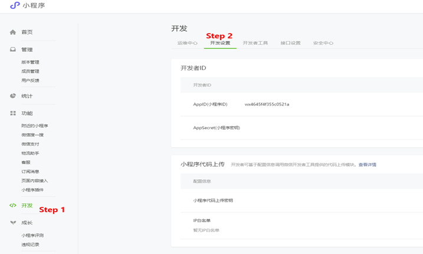
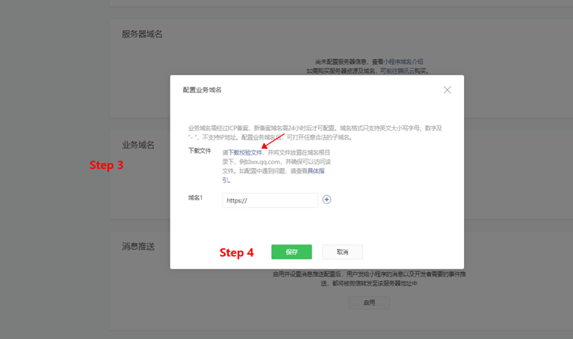

# 推啊小程序媒体对接

<!-- ## 产品介绍
 -->

## 类型一：使用WebView组件打开推啊互动广告

### 业务域名添加

推啊业务域名：
- https://engine.aoclia.com
- https://tui.yiyhua.cn

为保证WebView组件能够打开推啊域名，须添加小程序信任文件到推啊业务服务器，以及将推啊业务域名添加进小程序业务域名中。





### 基础实现代码样例
- wxml
  ```html
  <view>
    <web-view src="{{url}}" binderror="loadError" bindload="loadSuccess" />
  </view>
  ```
- js
  ```javascript
  Page({
    data: {
      url: '',
    },
    onLoad(options) {
      wx.showLoading({
        title: '页面加载中...'
      })

      const appKey = '' // your appKey
      const adslotId = '' // your adslotId
      this.setData({
        url: `https://engine.aoclia.com/index/activity?appKey=${appKey}&adslotId=${adslotId}`
      })
    },
    loadError(e) {
      console.error(e)
      wx.hideLoading()
    },
    loadSuccess(e) {
      console.log(e)
      wx.hideLoading()
    }
  })
  ```

### 测试

对接完成后请体验整个广告流程（WebView 打开推啊活动 -> 参加活动 -> 点击各类券 -> 进入落地页），如反复检验后仍有问题请联系推啊开发


## 类型二：跳转到推啊小程序

### 对接流程

- 合作方媒体在推啊媒体平台 (https://ssp.tuia.cn) 注册账号
- 创建广告位，在后台获取 appKey、adslotId
- 在广告入口处进行小程序跳转

### 跳转推啊小程序参数说明

- 推啊小程序appId为

  `wx4645f4f355c0521a`

- 推啊小程序跳转的path为

  `pages/activity/index`

- 跳转时需要携带的参数 **<font color="red">具体参考《推啊媒体API对接文档2.1.4版 》</font>**

  |  参数名称   | 参数定义  |  是否必传  |
  |  ----  | ----  |  ----  |
  | appKey  | 媒体的Key（从推啊媒体平台获取） |  必传  |
  | adslotId  | 广告位id（从推啊媒体平台获取） |  必传  |

  > 注意：

  > appKey 或 adslotId 值传错，进入空白页面。


### 基础实现代码样例
  ```javascript
  const params = {
    appKey: '', // your appKey
    adslotId: '', // your adslotId
  }
  function serialize(obj) {
    return Object.keys(obj)
      .map((key) =>
        obj[key] === null || obj[key] === undefined
          ? ''
          : key + '=' + obj[key]
      )
      .join('&');
  }
  const appConfig = {
    appId: 'wx4645f4f355c0521a',
    path: 'pages/activity/index?' + serialize(params),
    extraData: {},
    envVersion: 'release',
  }
  if (wx.navigateToMiniProgram) { // 兼容性处理
    wx.navigateToMiniProgram({
      ...appConfig,
      success(res) {
        console.log(res)
      },
      fail(res) {
        console.error(res)
      },
      complete(res) {
        console.log(res)
      }
    })
  } else {
    wx.showModal({
      title: '提示',
      content: '当前微信版本过低，无法使用该功能，请升级到最新微信版本后重试。'
    })
  }
  ```
  具体用法可以参见[wx.navigateToMiniProgram](https://developers.weixin.qq.com/miniprogram/dev/api/open-api/miniprogram-navigate/wx.navigateToMiniProgram.html)


## 修订记录

| 编号 | 内容 | 修订时间 | 影响范围 |
| :--- | :---: | :---: | :--: |
| 1 | Beta版 | 2020-06-23 | - |
